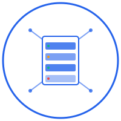

# ServerDash

<div align="center">
  
  
  **A comprehensive server monitoring and infrastructure management platform**

  
  
  
  
  
</div>

## 📖 Overview

ServerDash is a modern, feature-rich infrastructure monitoring platform that provides real-time insights into your servers, applications, and network devices. Built on **CoreControl**, ServerDash offers a beautiful, responsive dashboard for monitoring system health, tracking uptime, and managing your entire IT infrastructure from a single interface.

## ✨ Key Features

### 🖥️ **Server Monitoring**
- Real-time system metrics (CPU, RAM, disk usage, GPU, temperature)
- Multi-server support with host/VM relationships
- Historical data tracking and trend analysis
- Automatic server discovery and health checks

### 🌐 **Application Monitoring**
- Website and web application uptime monitoring
- Response time tracking
- Custom endpoint monitoring
- Uptime history and reporting

### 🔌 **Network Device Management**
- Support for switches, routers, firewalls, access points, and repeaters
- Device-specific monitoring (bandwidth, packet loss, response time)
- Network topology visualization
- SNMP and ping-based monitoring

### 🔔 **Advanced Notifications**
- Multi-channel notification support:
  - Email (SMTP)
  - Telegram
  - Discord webhooks
  - Gotify
  - ntfy
  - Pushover
  - EchoBell
- Customizable notification templates
- Real-time alerts for downtime and performance issues

### 🎨 **Modern Dashboard**
- Responsive, mobile-friendly interface
- Dark/light theme support
- Multi-language support (English, German)
- Real-time status indicators
- Interactive charts and graphs

### 🔐 **Security & Authentication**
- JWT-based authentication
- Secure password handling with bcrypt
- Input validation and sanitization
- SQL injection protection
- Comprehensive security logging

## 🛠️ Technologies Used

### Frontend
- **Next.js 15** - React framework with app router
- **React 19** - Modern React with hooks
- **TypeScript** - Type-safe development
- **Tailwind CSS** - Utility-first CSS framework
- **Radix UI** - Accessible component primitives
- **Chart.js** - Data visualization
- **Lucide React** - Modern icon library

### Backend
- **Next.js API Routes** - Serverless backend functions
- **Prisma ORM** - Type-safe database access
- **PostgreSQL** - Primary database
- **bcrypt** - Password hashing
- **JWT** - Secure authentication

### Infrastructure
- **Go Agent** - Lightweight monitoring agent
- **Docker** - Containerization
- **Docker Compose** - Multi-container deployment

## 🚀 Quick Start

### Prerequisites
- **Docker** and **Docker Compose**
- **Node.js 18+** (for development)
- **PostgreSQL** (if running outside Docker)

### Quick Setup (Recommended)

1. **Clone the repository**
   ```bash
   git clone https://github.com/typtech/serverdash.git
   cd serverdash
   ```

2. **Run the automated setup script**
   ```bash
   chmod +x setup.sh
   ./setup.sh
   ```
   
   The script will:
   - ✅ Copy environment template to `.env.local`
   - 🔐 Generate a secure JWT secret automatically
   - 🐳 Check Docker availability
   - 🚀 Start all services
   - 📊 Display access information

3. **Access the dashboard**
   - Open http://localhost:3000
   - **Login with default credentials:**
     - **Email:** `admin@example.com`
     - **Password:** `admin`
   - 🔒 **Important:** Change these credentials immediately after first login

4. **For subsequent starts, use the start script**
   ```bash
   ./start.sh
   ```
   
   This ensures environment variables are properly loaded from `.env.local`.

### Manual Setup (Alternative)

If you prefer manual configuration:

1. **Clone the repository**
   ```bash
   git clone https://github.com/typtech/serverdash.git
   cd serverdash
   ```

2. **Configure environment variables**
   ```bash
   # Copy environment template
   cp environment.template .env.local
   
   # Generate a secure JWT secret
   openssl rand -base64 64
   
   # Edit .env.local with your secure values
   nano .env.local
   ```
   
   **⚠️ Important**: Replace `JWT_SECRET` with the generated secure string and update database credentials.

3. **Start the services**
   ```bash
   # Method 1: Use the start script (recommended)
   chmod +x start.sh
   ./start.sh
   
   # Method 2: Manual start with environment loading
   export $(cat .env.local | grep -v '^#' | xargs) && docker-compose up -d
   ```

4. **Access the dashboard**
   - Open http://localhost:3000
   - **Login with default credentials:**
     - **Email:** `admin@example.com`
     - **Password:** `admin`
   - 🔒 **Security Notice:** Change these credentials immediately in Dashboard → Settings → User Management

### Development Setup

1. **Install dependencies**
   ```bash
   npm install
   ```

2. **Set up the database**
   ```bash
   # Start PostgreSQL
   docker-compose up db -d
   
   # Run database migrations
   npx prisma migrate deploy
   npx prisma generate
   ```

3. **Start the development server**
   ```bash
   npm run dev
   ```

4. **Build and run the Go agent** (optional)
   ```bash
   cd agent
   go build -o agent ./cmd/agent
   ./agent
   ```

## 📋 Environment Variables

Copy `environment.template` to `.env.local` and customize the following key variables:

```bash
# Database Configuration
DATABASE_URL="postgresql://postgres:ServerDash2024!@db:5432/serverdash"
POSTGRES_USER=postgres
POSTGRES_PASSWORD=ServerDash2024!
POSTGRES_DB=serverdash

# Security Configuration (CRITICAL)
JWT_SECRET="CHANGE_THIS_TO_A_SECURE_RANDOM_STRING_GENERATE_WITH_OPENSSL"

# Application Settings
NODE_ENV="production"
PORT=3000
WEB_EXTERNAL_PORT=3000
DB_EXTERNAL_PORT=5434

# Monitoring Configuration
UPTIME_CHECK_INTERVAL=60
SERVER_CHECK_INTERVAL=30
NETWORK_CHECK_INTERVAL=45

# Default Admin Credentials (Optional - for initial setup)
DEFAULT_ADMIN_EMAIL="admin@example.com"
DEFAULT_ADMIN_PASSWORD="admin"
```

**🔒 Security Note**: Always generate a new JWT secret with `openssl rand -base64 64` and use strong database passwords in production. Change the default admin credentials immediately after first login.

## 🎯 Usage

### Initial Login and Setup
1. **First Access**: Navigate to http://localhost:3000
2. **Default Login**: Use `admin@example.com` / `admin` 
3. **🚨 Critical**: Immediately change credentials in Settings → User Management
4. **Configure**: Set up your monitoring preferences and notification channels

### Adding Servers
1. Navigate to **Dashboard → Servers**
2. Click **"Add Server"**
3. Fill in server details (name, IP, monitoring URL)
4. Install the monitoring agent on your server
5. Enable monitoring to start collecting metrics

### Monitoring Applications
1. Go to **Dashboard → Applications**
2. Click **"Add Application"**
3. Enter application details and monitoring endpoints
4. Configure uptime check intervals
5. Set up notifications for downtime alerts

### Network Device Management
1. Access **Dashboard → Network Devices**
2. Add your network infrastructure:
   - Routers and switches
   - Wireless access points
   - Firewalls and security devices
3. Configure SNMP or ping monitoring
4. Monitor bandwidth and performance metrics

### Setting Up Notifications
1. Navigate to **Dashboard → Settings → Notifications**
2. Configure your preferred notification channels
3. Test notifications to ensure proper delivery
4. Customize alert templates for different scenarios

## 🏗️ Architecture

ServerDash consists of three main components built locally:

- **Web Dashboard** (Next.js): User interface and API - built from source
- **Monitoring Agent** (Go): Lightweight system metrics collector - built from source  
- **Uptime Service** (Node.js): Website and application monitoring

```
┌─────────────────┐    ┌─────────────────┐    ┌─────────────────┐
│   Web Dashboard │    │ Monitoring Agent│    │  Uptime Service │
│    (Next.js)    │◄──►│      (Go)       │    │   (Node.js)     │
└─────────────────┘    └─────────────────┘    └─────────────────┘
         │                       │                       │
         └───────────────────────┼───────────────────────┘
                                 ▼
                    ┌─────────────────┐
                    │   PostgreSQL    │
                    │    Database     │
                    └─────────────────┘
```

## 🔒 Security

ServerDash implements comprehensive security measures:

- **Authentication**: JWT-based secure authentication
- **Authorization**: Protected API endpoints
- **Input Validation**: Comprehensive validation and sanitization
- **Password Security**: bcrypt hashing with high salt rounds
- **SQL Injection Protection**: Prisma ORM with parameterized queries
- **XSS Prevention**: Input sanitization and output encoding
- **Initial Security**: Default credentials for easy setup (change immediately)

For detailed security information, see [SECURITY.md](SECURITY.md).

### 🚨 Production Security Recommendations
1. **Change default credentials** immediately after first login
2. **Generate strong JWT secret** using `openssl rand -base64 64`
3. **Use strong database passwords**
4. **Enable HTTPS** in production environments
5. **Configure proper firewall rules**
6. **Regular security updates**

## 🤝 Contributing

We welcome contributions to ServerDash! Please follow these guidelines:

1. **Fork the repository**
2. **Create a feature branch** (`git checkout -b feature/amazing-feature`)
3. **Follow our coding standards**:
   - Use TypeScript for type safety
   - Follow the existing code style
   - Add comprehensive comments
   - Write secure, production-ready code
4. **Test your changes** thoroughly
5. **Submit a pull request** with a clear description

### Development Guidelines
- Follow the security best practices outlined in `SECURITY.md`
- Use meaningful commit messages
- Ensure all tests pass
- Update documentation as needed

## 📜 License

This project is proprietary software. All rights reserved.

## 🆘 Support

- **Documentation**: Check our comprehensive guides
- **Issues**: Report bugs via GitHub Issues
- **Security**: Report security issues privately to [security@yourdomain.com]

## 🙏 Acknowledgements

- **CoreControl** - The foundation platform that ServerDash is built upon
- **Radix UI** - For providing excellent accessible components
- **Vercel** - For the amazing Next.js framework
- **Prisma** - For the powerful ORM and database toolkit
- **The Go Community** - For the efficient monitoring agent foundation

---

<div align="center">
  <p> Built with ❤️ for infrastructure monitoring (and so much Coffee☕☕☕)</p>
  <p>
    <a href="#serverdash">Back to top</a>
  </p>
</div> 