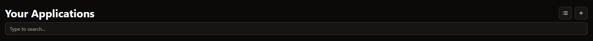

# Applications

Applications are all the self-hosted services you have running on your servers. You can add them to ServerDash to keep track of their status and get quick access to them.

## Adding an Application

To add a new application to ServerDash, follow these steps:

1. Click the "Add Application" button in the top right corner of the server menu:
   

2. Fill out the required information:
   - **Name**: The name of your application
   - **Description**: A brief description of what the application does
   - **Icon**: An icon URL for the application (you can use [selfh.st/icons](https://selfh.st/icons) for common applications)
   - **Public URL**: The URL where you can access the application from outside your network
   - **Local URL**: The URL for accessing the application within your local network (optional)
   - **Uptime Check URL**: The URL that ServerDash should check to determine if the application is online (optional)

3. After filling out the required information, click "Add" to add the application to ServerDash.

## Application Display

After adding applications, they will be displayed in a clear list format showing their status, name, and providing quick access buttons.