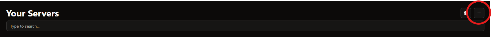
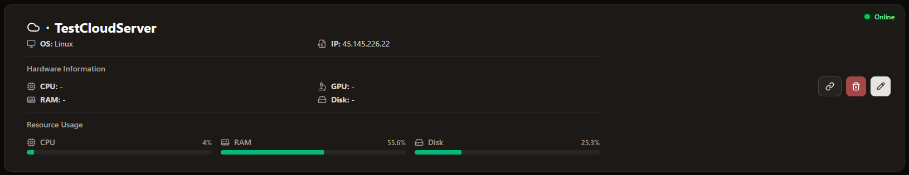
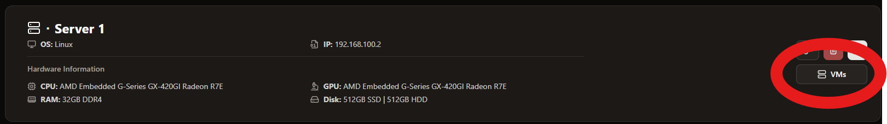
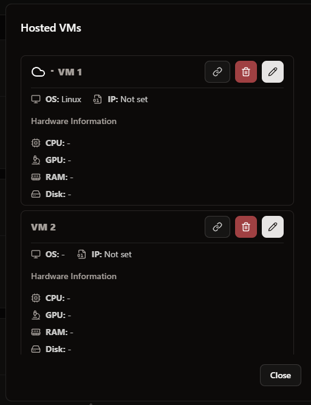

# Servers

All your servers are displayed here.

## Add a server

To add a new server to ServerDash, follow these steps:

1. Click the "Add Server" button in the top right corner of the server menu:
   

2. Fill out the server details across the following information:

- **Name**: Enter the name of the server
- **Icon URL**: Add the url pointing to the logo of the server. With the flash button the logo will be automatically selected.
- **Operating System**: Enter the operating system of the server, i.e. Ubuntu, Debian, CentOS, etc.
- **IP Address**: Enter the IP address of the server, for example "192.168.1.50"
- **URL**: Enter the URL to the management interface, for example: "https://192.168.1.50:8006" for Proxmox
- **CPU**: Enter the CPU of the server, i.e. Intel i5-12400F
- **GPU**: Enter the GPU(s) of the server, i.e. RTX 4070
- **RAM**: Enter the RAM of the server, i.e. 32GB DDR4
- **Disk**: Enter the disk(s) of the server, i.e. 2TB NVMe SSD
- **Monitoring**: Whether the monitoring is enabled for this server or not
- **Monitoring URL**: Enter the URL to your Glances endpoint. _(See note below)_

After filling out the required information, click "Add" to add the server to ServerDash.

## Server Display

Your servers are displayed in a list or grid (depending on the display settings) - each server in its own card.



To view the VMs and containers for a specific server, click the server from the list:





## Monitoring Note

For monitoring, you need to set up [Glances](https://github.com/nicolargo/glances) on your server and expose it via a web API.

To install Glances with Docker:

```bash
docker run -d --restart="always" -p 61208-61209:61208-61209 -e GLANCES_OPT="-w" -v /var/run/docker.sock:/var/run/docker.sock:ro --pid host nicolargo/glances:latest
```

Please also make sure that ServerDash can reach the specified API URL of Glances. In addition, the Glances API URL should be specified in the format `http://<IP_OF_SERVER>:61208`.
