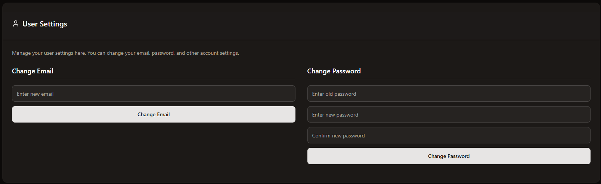
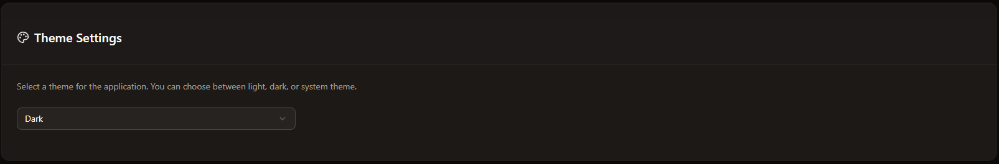
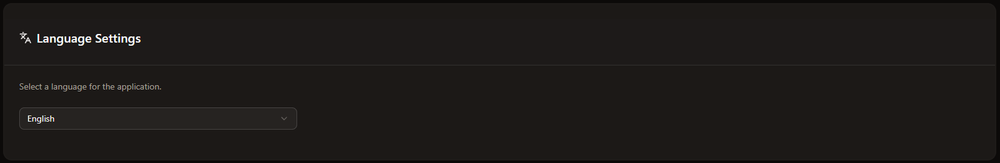
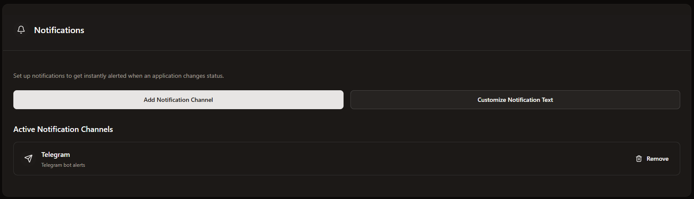

# Settings

Here you can manage the complete settings of ServerDash.

## User Settings

In user settings you can change your email and password.

## Theme Settings

Here you can change the theme (Light or Dark Theme).

## Language Settings

Here you can select your preferred language. Of course, not all languages are available right now. However, we are working continuously to make everything available in as many languages as possible so that you want everything to be displayed within ServerDash. Currently there is the standard language "English" and the language German.

## Notification Settings

To receive notifications from ServerDash, you can add all your notification providers here. You can also customize the notification text.